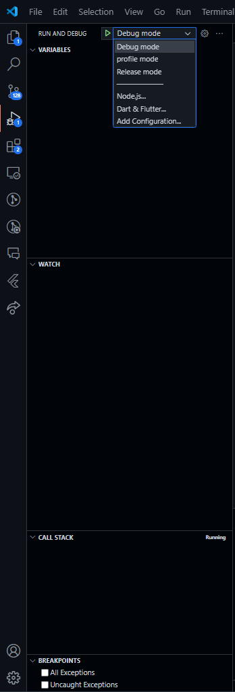

- [Instalação](#instalação)
- [Estrutura](#estrutura)
- [Organização de pastas dentro de um módulo](#Organização-de-pastas-dentro-de-um-módulo)


### Instalação

- Para fazer a instalação do app e executa-lo, basta clonar esse repositório, abrir o projeto no vscode e no menu esquerdo do vscode onde tem a aba de Run and Debug e escolher o modo que irá executar.


### Estrutura

- Todo nome de arquivo deve terminar com o pattern separado por `.`.

Exemplo:

```sh
exemplo.model.dart
exemplo.repository.dart
exemplo.controller.dart
exemplo.service.dart
exemplo.ds.dart
exemplo.page.dart/exemplo.page.dart
exemplo.widget.dart
exemplo.module.dart
```

#### Organização de pastas dentro de um módulo

- Cada módulo encapsula suas próprias responsabilidades.
- A utilização de interfaces dos repositórios no módulo Domain e a definição de modelos específicos nos models na camada de infraestrutura, ajudam a abstrair a implementação dos repositórios, permitindo a manutenção ou troca dessa implementação.
- Baixo acoplams camadas e módulos fornecendo uma melhor organização do que está sendo feito.
- Realizar as implementações baseadas eento entre am contratos ajuda a realizar a troca da implementação quando necessário. Exemplo: Tendo uma interface para representar os métodos de consumo da api, podemos criar uma implementação utilizando algum pacote externo do framework, e caso esse pacote seja descontinuado ou seja necessário a troca, basta mudar/corrigir a implementação.


```txt
├── domain
│   ├── repositories
│   │   └── i.feature.repository.dart //Define interfaces para os repositórios que serão implementados em camadas externas, como data sources. Isso permite a inversão de dependência.
│   └── usecases
│       ├── feature.usecase.dart // Casos de uso que serão criados nesse módulo e que poderão ser testados para garantir o que foi feito.
├── external
│   └── data.source 
│       ├── feature.ds.dart //Realiza a chamada a api e trata o retorno da mesma
├── infra
│   ├── data.source
│   │   └── i.feature.ds.dart //Define interfaces para os métodos que serão implementados na camada externa
│   └── repositories
│       ├── feature.repository.dart // Realiza a implementação das interfaces definidas na camada domain
├── presenter // Camada de apresentação do app, onde fica as telas e a lógica das telas
│   ├── Controllers//Stores
│   │   ├── feature.controller.dart
│   ├── pages
│   │   ├── feature.page.dart
│   ├── widgets
│   │   ├── buttons
│   │   │   └── button.widget.dart
```
